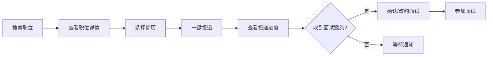
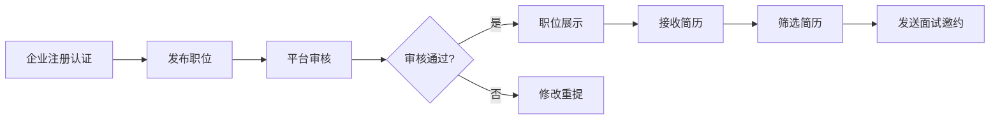

# 求职招聘 Web 平台 产品需求文档

## 1. 产品概述

求职招聘 Web 平台是一款连接求职者与中小企业的在线招聘服务平台，致力于为求职者提供便捷的职位搜索、简历管理和求职服务，为中小企业提供高效的人才招聘解决方案。

- **核心目标**：降低招聘与求职的信息差，提升匹配效率，打造可信赖的招聘生态
- **目标用户**：求职者（应届毕业生、职场人士）、中小企业招聘人员（HR、招聘主管）
- **市场价值**：填补中小企业招聘成本高、效率低的市场空白，为求职者提供更多优质机会

## 2. 核心功能

### 2.1 用户角色

| 角色 | 注册方式 | 核心权限 |
|------|----------|----------|
| 求职者 | 手机号/邮箱注册 | 搜索职位、投递简历、管理简历、查看投递进度、面试管理、消息沟通 |
| 企业招聘者 | 企业认证后注册 | 发布职位、管理职位、查看简历、邀约面试、消息沟通、企业主页管理 |
| 平台管理员 | 后台账号登录 | 审核企业资质、审核职位、处理举报、管理平台内容 |

### 2.2 功能模块

1. **职位列表页**：职位搜索、多维度筛选、薪资对比、地点对比、职位收藏
2. **职位详情页**：职位信息展示、企业信息、相似职位推荐、一键投递、举报功能
3. **简历中心页**：在线简历编辑、附件简历上传、求职意向设置、简历可见范围控制
4. **企业主页页**：企业资质展示、公司介绍、在招职位、企业风采
5. **投递管理页**：投递进度查看、投递记录管理、职位收藏夹
6. **面试安排页**：面试邀约列表、面试时间改约、面试详情查看
7. **消息通知页**：站内消息沟通、系统通知、消息分类管理
8. **后台审核页**：企业资质审核、职位审核、举报处理、上下架管理

### 2.3 页面详情

| 页面名称 | 模块名称 | 功能描述 |
|----------|----------|----------|
| 职位列表 | 搜索栏 | 关键词搜索、职位类别选择、工作地点选择 |
| 职位列表 | 筛选侧边栏 | 薪资范围、工作经验、学历要求、公司规模、发布时间 |
| 职位列表 | 职位卡片列表 | 职位名称、公司名、薪资、地点、经验要求、收藏按钮 |
| 职位列表 | 对比功能 | 薪资对比、地点对比，支持最多3个职位对比 |
| 职位详情 | 职位头部 | 职位名称、薪资、公司logo、公司名称、工作地点 |
| 职位详情 | 职位描述 | 岗位职责、任职要求、福利待遇 |
| 职位详情 | 企业信息卡 | 公司简介、公司规模、行业领域、资质认证标识 |
| 职位详情 | 操作区 | 立即投递、收藏职位、分享职位、举报职位 |
| 职位详情 | 相似职位 | 基于职位标签推荐相似职位 |
| 简历中心 | 简历概览 | 头像、姓名、求职状态、完整度进度条 |
| 简历中心 | 在线简历编辑 | 基本信息、教育经历、工作经历、项目经历、技能特长 |
| 简历中心 | 附件简历 | 上传/下载/删除附件简历，支持PDF/DOC格式 |
| 简历中心 | 求职意向 | 期望职位、期望薪资、期望城市、求职状态 |
| 简历中心 | 隐私设置 | 简历可见范围控制（公开/仅投递企业/隐藏） |
| 企业主页 | 企业头部 | 公司logo、公司名称、行业、规模、资质认证 |
| 企业主页 | 公司介绍 | 公司简介、发展历程、企业文化 |
| 企业主页 | 企业风采 | 公司环境照片、团队活动 |
| 企业主页 | 在招职位 | 该企业发布的所有在招职位列表 |
| 企业主页 | 工商信息 | 企业资质展示、统一社会信用代码、成立时间 |
| 投递管理 | 投递记录 | 全部投递、待处理、面试中、已offer、已拒绝 |
| 投递管理 | 投递详情 | 投递时间、简历状态、处理进度时间线 |
| 投递管理 | 收藏夹 | 已收藏的职位列表，支持取消收藏 |
| 面试安排 | 面试列表 | 即将面试、历史面试、待确认 |
| 面试安排 | 面试详情 | 面试时间、面试方式、面试官、面试地址/链接 |
| 面试安排 | 改约功能 | 申请改约、选择新时间、提交改约原因 |
| 消息通知 | 消息分类 | 系统通知、面试消息、投递消息、聊天消息 |
| 消息通知 | 聊天功能 | 与HR一对一沟通、发送文字消息 |
| 消息通知 | 消息设置 | 消息免打扰、消息推送设置 |
| 后台审核 | 企业审核 | 待审核企业列表、企业资质查看、通过/拒绝 |
| 后台审核 | 职位审核 | 待审核职位列表、职位详情查看、上架/下架 |
| 后台审核 | 举报处理 | 违规举报列表、举报详情、处理结果 |
| 后台审核 | 数据概览 | 平台数据统计、审核趋势 |

## 3. 核心流程

### 3.1 求职者投递流程

求职者在职位列表搜索筛选心仪职位，查看职位详情确认匹配度后，选择在线简历或附件简历进行一键投递，投递后可在投递管理中查看进度，收到面试邀约后可确认或改约面试时间。

### 3.2 企业招聘流程

企业完成资质认证后发布职位，职位经平台审核通过后展示在职位列表中，企业收到求职者投递后筛选简历，对合适的候选人发送面试邀约，通过站内消息沟通面试细节。

## 4. 用户界面设计

### 4.1 设计风格

- **主色调**：深蓝色系（#1e3a5f）作为主色，传递专业、可信赖的品牌感觉
- **辅助色**：橙金色（#f59e0b）作为强调色，用于CTA按钮、重要提示
- **背景色**：浅灰蓝色调（#f0f4f8）营造清爽专业的氛围
- **按钮风格**：圆角设计（8px），主按钮采用渐变效果，悬停有微放大动画
- **字体**：标题使用思源黑体（Source Han Sans），正文使用系统无衬线字体
- **布局风格**：卡片式布局，清晰的视觉层次，充足的留白空间
- **图标风格**：线性图标，统一的2px描边，配合轻微填充色

### 4.2 页面设计概述

| 页面名称 | 模块名称 | UI 元素 |
|----------|----------|---------|
| 职位列表 | 搜索栏 | 大号搜索框、搜索按钮动效、分类标签云 |
| 职位列表 | 筛选侧边栏 | 手风琴式筛选组、滑块选择器、多选标签 |
| 职位列表 | 职位卡片 | 悬浮上移动效、薪资标签高亮、收藏按钮心跳动画 |
| 职位详情 | 职位头部 | 大标题、薪资胶囊样式、公司logo圆角方形 |
| 职位详情 | 信息模块 | 图标+文字组合、分割线、折叠展开动画 |
| 职位详情 | 相似职位 | 横向滚动卡片、渐变遮罩 |
| 简历中心 | 侧边导航 | 图标+文字、选中态高亮、平滑过渡 |
| 简历中心 | 编辑表单 | 分段编辑、保存按钮悬浮、输入框聚焦动效 |
| 企业主页 | 企业头部 | 封面图+logo叠加、资质徽章、关注按钮 |
| 投递管理 | 进度时间线 | 竖向时间线、状态节点动画、进度连接线 |
| 消息通知 | 消息列表 | 头像+未读数红点、消息预览截断、时间靠右 |
| 后台审核 | 数据看板 | 数据卡片、统计图表、状态标签 |

### 4.3 响应式设计

- **设计原则**：桌面端优先，响应式适配平板和移动端
- **断点设置**：1200px（桌面）、768px（平板）、480px（手机）
- **移动端优化**：侧边栏转为底部抽屉、搜索栏置顶、卡片列表单列布局、触摸目标≥44px
- **触摸优化**：按钮尺寸适配手指点击、支持横滑操作、下拉刷新

### 4.4 动效设计

- **页面进入**：内容区渐入+轻微上移动画，采用错落延迟
- **卡片交互**：悬停时上浮2px，阴影加深，过渡时长0.2s
- **按钮交互**：点击时有缩放反馈（scale: 0.96）
- **状态切换**：使用淡入淡出过渡，避免生硬切换
- **加载状态**：骨架屏占位，内容加载后平滑过渡

