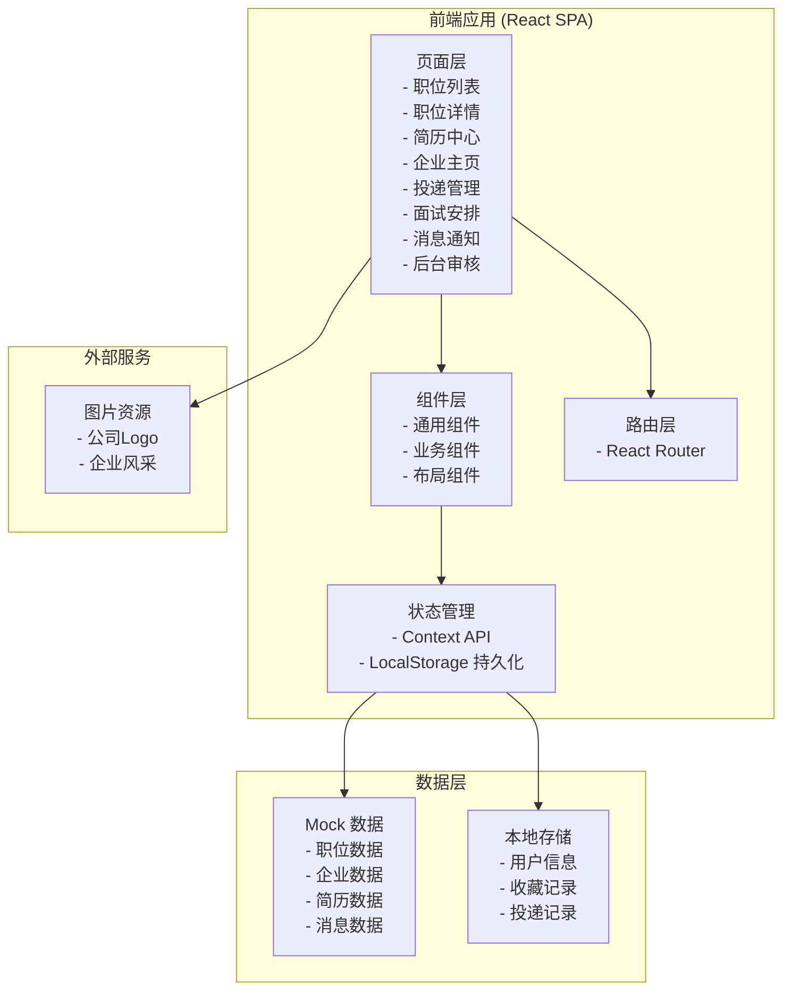

# 求职招聘 Web 平台 技术架构文档

## 1. 架构设计



## 2. 技术描述

- **前端框架**：React@18 + TypeScript
- **构建工具**：Vite@5
- **样式方案**：Tailwind CSS@3
- **路由管理**：React Router@6
- **状态管理**：React Context + useReducer
- **图标库**：Lucide React
- **数据模拟**：前端 Mock 数据 + LocalStorage
- **代码规范**：ESLint + Prettier

### 技术选型理由

1. **React + TypeScript**：提供类型安全和组件化开发，适合中大型项目维护
2. **Vite**：开发体验好，构建速度快，支持热更新
3. **Tailwind CSS**：快速构建UI，统一设计规范，响应式支持完善
4. **React Router**：官方推荐路由方案，功能完善
5. **Lucide React**：轻量级图标库，风格统一，支持按需引入

## 3. 路由定义

| 路由路径 | 页面名称 | 说明 |
|----------|----------|------|
| `/` | 职位列表 | 首页，职位搜索和筛选 |
| `/job/:id` | 职位详情 | 单个职位的详细信息 |
| `/resume` | 简历中心 | 简历编辑和管理 |
| `/company/:id` | 企业主页 | 企业信息和在招职位 |
| `/applications` | 投递管理 | 投递记录和收藏夹 |
| `/interviews` | 面试安排 | 面试邀约和改约 |
| `/messages` | 消息通知 | 站内消息和系统通知 |
| `/admin` | 后台审核 | 平台管理后台 |

## 4. 数据模型

### 4.1 数据模型定义

```mermaid
erDiagram
    USER ||--o| RESUME : 拥有
    USER ||--o{ APPLICATION : 投递
    USER ||--o{ MESSAGE : 接收
    USER ||--o{ FAVORITE : 收藏
    COMPANY ||--o{ JOB : 发布
    JOB ||--o{ APPLICATION : 收到
    JOB ||--o{ FAVORITE : 被收藏
    COMPANY ||--o{ INTERVIEW : 发起
    USER ||--o{ INTERVIEW : 参加
    APPLICATION ||--o| INTERVIEW : 产生
    
    USER {
        string id PK
        string name
        string avatar
        string email
        string phone
        string role
        string status
    }
    
    RESUME {
        string id PK
        string userId FK
        string basicInfo
        string education
        string experience
        string projects
        string skills
        number completeness
        string visibility
    }
    
    COMPANY {
        string id PK
        string name
        string logo
        string industry
        string scale
        string description
        string certification
        string status
    }
    
    JOB {
        string id PK
        string companyId FK
        string title
        string salary
        string location
        string experience
        string education
        string description
        string requirements
        string benefits
        string status
        date publishDate
    }
    
    APPLICATION {
        string id PK
        string userId FK
        string jobId FK
        string resumeId
        string status
        date applyDate
    }
    
    INTERVIEW {
        string id PK
        string applicationId FK
        string companyId FK
        string userId FK
        datetime time
        string type
        string interviewer
        string location
        string status
    }
    
    MESSAGE {
        string id PK
        string senderId
        string receiverId
        string type
        string content
        boolean isRead
        date createdAt
    }
    
    FAVORITE {
        string id PK
        string userId FK
        string jobId FK
        date createdAt
    }
```



### 4.2 核心类型定义

```typescript
// 用户类型
interface User {
  id: string;
  name: string;
  avatar: string;
  email: string;
  phone: string;
  role: 'jobseeker' | 'employer' | 'admin';
  status: 'active' | 'inactive';
}

// 企业类型
interface Company {
  id: string;
  name: string;
  logo: string;
  coverImage: string;
  industry: string;
  scale: string;
  description: string;
  certification: {
    hasCertified: boolean;
    creditCode: string;
    establishDate: string;
    legalPerson: string;
  };
  status: 'pending' | 'approved' | 'rejected';
  jobCount: number;
}

// 职位类型
interface Job {
  id: string;
  companyId: string;
  title: string;
  salary: {
    min: number;
    max: number;
    type: 'monthly' | 'yearly';
  };
  location: {
    city: string;
    district: string;
    address: string;
  };
  experience: string;
  education: string;
  tags: string[];
  description: string;
  requirements: string[];
  benefits: string[];
  status: 'pending' | 'active' | 'offline' | 'rejected';
  publishDate: string;
  viewCount: number;
}

// 简历类型
interface Resume {
  id: string;
  userId: string;
  basicInfo: {
    name: string;
    avatar: string;
    gender: string;
    age: number;
    phone: string;
    email: string;
    location: string;
    workYears: number;
  };
  jobIntention: {
    position: string;
    salaryMin: number;
    salaryMax: number;
    city: string;
    status: string;
  };
  education: EducationItem[];
  experience: ExperienceItem[];
  projects: ProjectItem[];
  skills: string[];
  attachments: AttachmentItem[];
  completeness: number;
  visibility: 'public' | 'applied' | 'private';
}

// 投递记录类型
interface Application {
  id: string;
  userId: string;
  jobId: string;
  job: Job;
  company: Company;
  resumeType: 'online' | 'attachment';
  status: 'pending' | 'reviewing' | 'interview' | 'offer' | 'rejected';
  applyDate: string;
  timeline: TimelineItem[];
}

// 面试类型
interface Interview {
  id: string;
  applicationId: string;
  userId: string;
  companyId: string;
  jobTitle: string;
  companyName: string;
  time: string;
  type: 'onsite' | 'video' | 'phone';
  interviewer: string;
  location: string;
  status: 'pending' | 'confirmed' | 'rescheduled' | 'cancelled' | 'completed';
  notes: string;
  rescheduleHistory: RescheduleItem[];
}

// 消息类型
interface Message {
  id: string;
  type: 'system' | 'interview' | 'application' | 'chat';
  senderId: string;
  senderName: string;
  senderAvatar: string;
  receiverId: string;
  title: string;
  content: string;
  isRead: boolean;
  createdAt: string;
}
```

## 5. 目录结构

```
src/
├── components/          # 通用组件
│   ├── Layout/         # 布局组件
│   ├── JobCard/        # 职位卡片
│   ├── SearchBar/      # 搜索栏
│   ├── FilterPanel/    # 筛选面板
│   └── common/         # 基础组件
├── pages/              # 页面组件
│   ├── JobList/        # 职位列表
│   ├── JobDetail/      # 职位详情
│   ├── ResumeCenter/   # 简历中心
│   ├── CompanyPage/    # 企业主页
│   ├── Applications/   # 投递管理
│   ├── Interviews/     # 面试安排
│   ├── Messages/       # 消息通知
│   └── Admin/          # 后台审核
├── context/            # 状态管理
├── data/               # Mock 数据
├── types/              # TypeScript 类型
├── utils/              # 工具函数
├── hooks/              # 自定义 Hooks
├── App.tsx
└── main.tsx
```

## 6. 关键技术点

### 6.1 状态管理方案

- 使用 React Context + useReducer 管理全局状态
- 按功能模块划分 Context：UserContext、JobContext、MessageContext
- 利用 LocalStorage 持久化用户偏好和收藏记录

### 6.2 性能优化

- 路由懒加载（React.lazy + Suspense）
- 组件按需渲染，使用 React.memo 优化
- 列表虚拟化（可选，针对大量职位数据）
- 图片懒加载

### 6.3 响应式实现

- 基于 Tailwind CSS 的响应式工具类
- 桌面端：侧边栏 + 主内容区布局
- 平板端：筛选区收起为下拉
- 移动端：单列布局，底部导航

